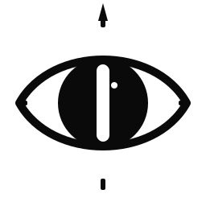

<p align="center">
  <picture>
    <source media="(prefers-color-scheme: dark)" srcset="brand/logo-dark.svg">
    <source media="(prefers-color-scheme: light)" srcset="brand/logo-light.svg">
    
  </picture>
</p>

<h1 align="center">lynx</h1>

<p align="center">
  <strong>sharp-eyed visual-audit suite for Claude Code</strong><br>
  <a href="https://github.com/krzemienski/lynx/releases/tag/v1.0.0"></a>
  
  
  
</p>

---

> Two coupled skills find UI/UX defects through real-system probes — contrast failures, false affordances, modal opacity, latent contract mismatches. No mocks. No test files. Evidence-cited verdicts. **9/9 detection accuracy on a known-mole synthetic.**

A lynx sees what humans miss — high-acuity, low-light, motion-locked. This plugin gives Claude Code the same eye for UI defects: pre-attentive saliency, perceptual outliers, latent regressions that only surface after a fix unmasks them.

---

## Install

```bash
# In a fresh Claude Code session:
/plugin marketplace add krzemienski/lynx
/plugin install lynx@lynx-dev

# Restart Claude Code, then verify in a new session:
# Both skills should appear in the available-skills system-reminder.
```

For local development:

```bash
git clone https://github.com/krzemienski/lynx
/plugin marketplace add /path/to/lynx
/plugin install lynx@lynx-dev
```

---

## What ships

| Skill | Purpose | Trigger phrases |
|---|---|---|
| **`full-ui-experience-audit`** | App-wide audit + auto-remediation loop. Discovers every screen, runs UX + functional checks, applies fixes, re-audits until threshold met or cycle cap fires. | "audit and fix the whole app", "production readiness loop", "find and fix every issue", "loop until clean" |
| **`ui-experience-audit`** | Per-screen deep audit (visual / interactive / content / Nielsen heuristics). No remediation, no app-wide loop. | "audit this screen", "review this screenshot", "QA this view", "is this UI good" |

The two compose: the full skill delegates per-screen passes to the per-screen skill via Phase 0h complementary-skill detection.

---

## Decision matrix — which skill fires

| Query | Skill |
|---|---|
| "audit and fix my next.js dashboard until it passes" | `full-ui-experience-audit` |
| "production readiness loop on my web app" | `full-ui-experience-audit` |
| "audit and fix the whole app, loop until clean" | `full-ui-experience-audit` |
| "audit this single screen for visual issues" | `ui-experience-audit` |
| "review this dashboard screenshot for UX problems" | `ui-experience-audit` |
| "QA this view for accessibility" | `ui-experience-audit` |

Trigger keywords for **full**: "loop", "max cycles", "fix until", "until clean", "whole app", "production readiness". Trigger keywords for **per-screen**: "this screen", "this screenshot", "this page", "this view", "single".

---

## The Iron Rule

```
IF the real system does not work, FIX THE REAL SYSTEM.
NEVER create mocks, stubs, test doubles, or test files.
NEVER write .test.ts, _test.go, Tests.swift, test_*.py, or any test harness.
ALWAYS validate through the same interfaces real users experience.
ALWAYS capture evidence. ALWAYS review evidence. ALWAYS write verdicts.
```

Lynx refuses to declare PASS without cited evidence. Threshold relaxations are forbidden mid-run. Cycle caps fire honestly. The skill chooses CYCLE-CAP REACHED over a manufactured green run.

---

## What lynx catches (and why)

5 reporting-tightening edits in v1.0 — each grounded in real-target shakedown evidence:

1. **Modal backdrop opacity floor (≥ 0.3)** — backdrops at 0.1 silently fail Nielsen #1 (visibility of system status). Lynx checks via `agent-browser eval` of computed background-color alpha channel.
2. **Response-shape contract validation** — client reads `data.settings.name`, server returns `{saved: true}`. Lynx greps client `data.X.Y` accesses against live-server JSON to catch the mismatch *before* the user clicks Save.
3. **APCA worked example** — `#777 on #222 → Lc 32 (fails Lc 60)`. WCAG 2 ratios miss what APCA catches; lynx ships both.
4. **`cursor:pointer` no-handler** — element looks tappable but no JS handler is bound. Lynx greps `cursor:pointer`, then probes `getEventListeners` (or click-diff fallback) per selector.
5. **Shared-token cascade** — design tokens reused across visual roles will fail when one role's value is changed. Lynx audits token reuse *before* applying the cycle-1 fix, predicting cycle-2 unmasks instead of being surprised by them.

---

## Empirical detection accuracy

Two real-target shakedowns. See [`shakedowns/`](./shakedowns/) for full evidence.

### Whac-A-Mole synthetic — entangled defects, FAIL (CYCLE-CAP REACHED)

| Skill | HIT | MISS | FALSE-POSITIVE | Detection |
|---|---|---|---|---|
| `full-ui-experience-audit` | 9/9 | 0 | 0 | **100%** + correctly produced `FAIL (CYCLE-CAP REACHED)` per fixture spec, threshold relaxations: none |
| `ui-experience-audit` | 9/9 (5 HIT + 4 HIT-FORESHADOW) | 0 | 0 | **100%** including correct latent/foreshadow classification |

The synthetic was deliberately constructed so fixing one defect unmasks another (entangled-fix design). Lynx caught the entanglement chain across all 3 cycles before the cap fired — the verdict honors the cap rather than ratcheting threshold to manufacture a green run.

### synth-2 — independent defects, PASS at cycle 2

| Skill | HIT | MISS | FALSE-POSITIVE | Detection |
|---|---|---|---|---|
| `full-ui-experience-audit` | 5/5 | 0 | 0 | **100%** — converged at cycle 2 after fix-loop applied |
| `ui-experience-audit` | 5/5 | 0 | 0 | **100%** across 5-phase per-screen protocol |

5 independent defect classes, distinct from WAM's: modal trap, unlabeled inputs, color-only error / APCA fail, fixed-px caption, false `cursor:pointer` affordance. See [`shakedowns/synth-2/findings.md`](./shakedowns/synth-2/findings.md).

### Combined corpus

**14/14 = 100% detection** across both convergence modes (FAIL-on-cap + PASS-within-cap).

---

## Plugin structure

```
lynx/
├── .claude-plugin/
│   ├── plugin.json
│   ├── marketplace.json
│   └── README.md
├── skills/
│   ├── full-ui-experience-audit/
│   │   ├── SKILL.md
│   │   ├── references/      # 7 deep-protocol files
│   │   ├── scripts/         # complementary-skill-detection.sh
│   │   └── assets/
│   └── ui-experience-audit/
│       ├── SKILL.md
│       ├── references/      # 7 checklist + heuristic files
│       └── assets/
├── brand/                   # logo, social card, banner — see brand/README.md
├── shakedowns/              # real-target audit corpus (WAM + synth-2 = 14/14)
│   └── synth-2/             # 5-defect single-screen synthetic
├── marketplace-submissions/ # issue/PR templates for cross-listing
├── install-evidence/        # live tmux-driven install verification
├── README.md (this file)
└── LICENSE
```

---

## Sibling plugins

Lynx is part of the same family of evidence-gated tooling:

- **[crucible](https://github.com/krzemienski/crucible)** — evidence-gated task planning, execution, and validation. Refuses completion without quorum-approved proof.
- **[validationforge](https://github.com/krzemienski/validationforge)** — no-mock functional validation platform. Iron Rule enforced through hooks + skills + agents.
- **[anneal](https://github.com/krzemienski/anneal)** — multi-variant AI planning framework. Cast / Alloy / Temper plugins for Claude Code.

Lynx specializes the Iron Rule for the visual layer: real DOMs, real screenshots, real `agent-browser` probes, real APCA computations. No fake screens, no recorded fixtures.

---

## License

MIT — see [LICENSE](./LICENSE).
