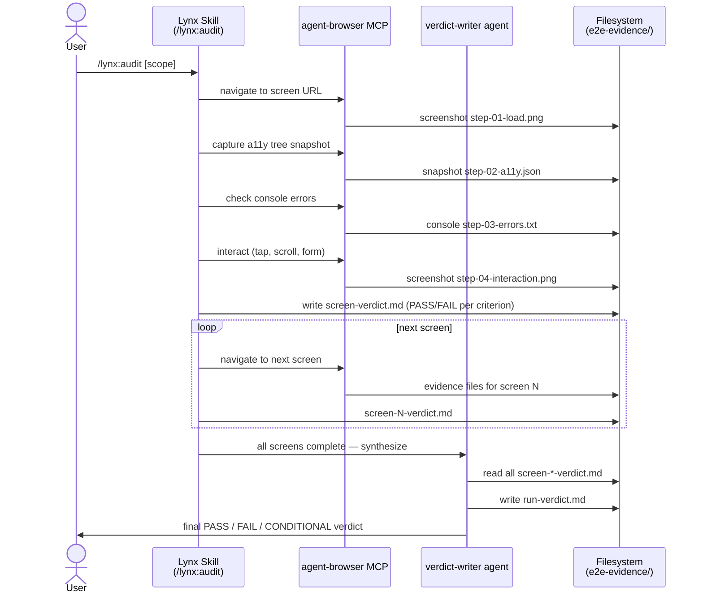
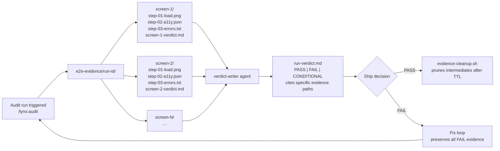
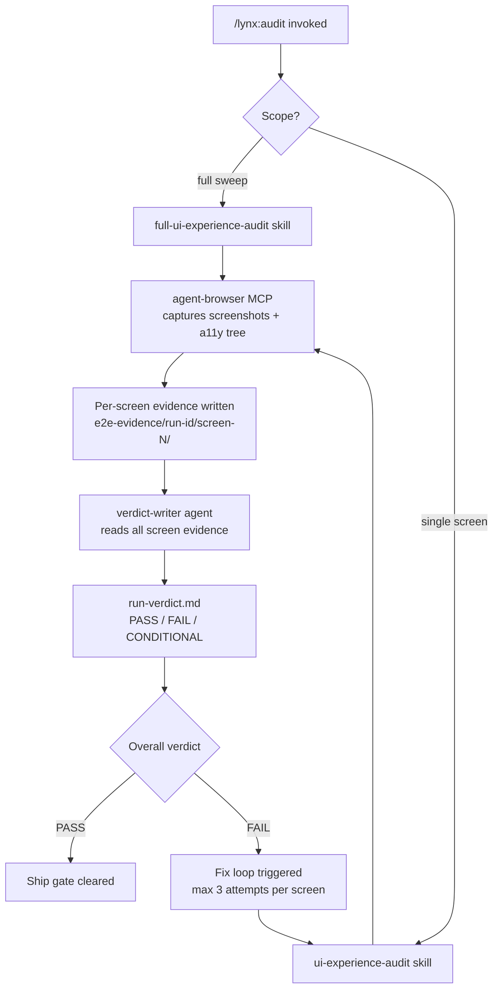

Lynx is a Claude Code plugin that delivers evidence-gated UI/UX auditing via two frozen skills,
a mandatory `agent-browser` MCP dependency, and a verdict-writer synthesis agent. This document
maps every component, explains how data flows through an audit run, and shows how lynx fits among
its sibling plugins (anneal, crucible, validationforge).

---

## Executive Summary

Lynx audits web UIs through real browser interaction — no mocks, no stubs, no synthetic DOM
snapshots. An audit run produces per-screen evidence files (screenshots, a11y trees, console
logs) which a `verdict-writer` agent synthesizes into a single `run-verdict.md` with a
PASS / FAIL / CONDITIONAL verdict.

**Capability snapshot:**

| Dimension | Value |
|-----------|-------|
| Skills | 2 (`full-ui-experience-audit`, `ui-experience-audit`) |
| Commands | 4 |
| Hooks | 5 |
| Agents | 1 (`verdict-writer`) |
| MCP dependency | `agent-browser` (mandatory) |
| Detection rate | 14/14 (100%) — WAM 9/9 + synth-2 5/5 |
| Cycle cap | 2 fix iterations per screen |
| Entanglement classes | WAM-class (cycle-2 reach), synth-2-class (cycle-1 reach) |

Both skills are frozen post-shakedown. **Do not modify skills without re-running shakedowns.**

---

## Component Map

```
lynx/
├── skills/
│   ├── full-ui-experience-audit/   ← composite loop: baseline → fix → re-audit
│   │   └── SKILL.md
│   └── ui-experience-audit/        ← per-screen 5-phase audit
│       └── SKILL.md
├── commands/                       ← 4 slash commands (/lynx:audit, etc.)
├── hooks/                          ← 5 lifecycle hooks
├── agents/                         ← verdict-writer agent definition
├── shakedowns/
│   ├── wam/                        ← WAM shakedown: 9/9 defects detected
│   └── synth-2/                    ← synth-2 shakedown: 5/5 defects detected
├── e2e-evidence/                   ← runtime evidence (gitignored)
├── diagrams/                       ← mermaid + SVG diagrams for this doc
├── ARCHITECTURE.md                 ← this file
├── CLAUDE.md                       ← agent behavior rules (Claude Code)
└── AGENTS.md                       ← agent behavior rules (OpenAI Agents SDK)
```

### Component responsibilities

**`full-ui-experience-audit` skill** — The outer loop. Iterates over every in-scope screen,
calls `ui-experience-audit` for each, tracks per-screen verdicts, detects entanglement
(whether a fix on screen N caused a regression on screen M), and invokes `verdict-writer`
when all screens are processed.

**`ui-experience-audit` skill** — The inner loop. Runs a 5-phase audit on a single screen:

| Phase | Name | What happens |
|-------|------|--------------|
| 0 | Triage | Load screen, check console errors, capture baseline screenshot |
| 1 | Visual | Layout, color contrast, spacing, typography |
| 2 | Interactive | Tap targets, form flows, keyboard navigation |
| 3 | Content quality | Microcopy, empty states, error messages |
| 4 | UX heuristics | Visibility of system status, user control, consistency |
| 5 | Synthesis | Emit `screen-N-verdict.md` (PASS / FAIL + cited evidence) |

**`verdict-writer` agent** — Reads all `screen-*-verdict.md` files after all screens
complete. Produces `run-verdict.md` with an overall verdict and per-screen summary table.
Independent from the auditing agent — enforces the no-self-review rule.

**`agent-browser` MCP** — The only permitted browser interaction surface. Provides
`navigate`, `screenshot`, `a11y-snapshot`, `click`, `type`, `scroll` primitives.
All evidence captured through `agent-browser`; no direct Playwright or Puppeteer usage.

**Hooks (5 total):**

| Hook | Trigger | Purpose |
|------|---------|---------|
| `evidence-gate` | TaskUpdate (complete) | Blocks completion without evidence citation |
| `no-mock-guard` | Write / Edit | Blocks creation of test/mock/stub files |
| `plan-before-execute` | Write / Edit | Warns if no planning artifact detected |
| `subagent-context-enforcer` | Agent spawn | Ensures subagents receive file/path context |
| `completion-claim-validator` | Bash | Catches "done" claims without functional evidence |

---

## Data Flow

The full audit pipeline from `/lynx:audit` invocation to `run-verdict.md`:



### Evidence structure

Each audit run writes evidence under a timestamped run directory:



Evidence retention: FAIL evidence preserved indefinitely. PASS evidence pruned after TTL
(default 30 days). In-progress runs protected by a lock file at
`.lynx/state/audit-in-progress.lock`.

---

## Phase Model

An audit run has four phases. Each phase is a gate — failure stops advancement.

```
Phase 0: PREFLIGHT
  └── agent-browser MCP reachable?
  └── target URL responds?
  └── evidence directory writable?

Phase 1: AUDIT (per-screen loop)
  └── ui-experience-audit skill runs for each screen
  └── screen-N-verdict.md written after each screen
  └── entanglement check after each fix cycle

Phase 2: SYNTHESIS
  └── verdict-writer reads all screen-*-verdict.md
  └── run-verdict.md written

Phase 3: SHIP GATE
  └── PASS → evidence-cleanup.sh scheduled
  └── FAIL → fix loop (max 2 iterations per screen)
  └── CONDITIONAL → human override required
```

### Fix loop mechanics

When a screen verdict is FAIL:
1. Lynx reports the failing criteria with cited evidence paths.
2. The user (or an upstream orchestrator) applies a fix to the real system.
3. Lynx re-audits the failing screen (not the full sweep — targeted re-audit).
4. Cycle counter increments. Cap = 2.
5. After 2 failed fix attempts, screen is marked `UNFIXABLE` and the run continues.

The cycle cap prevents infinite remediation loops on deep regressions.

---

## Entanglement Detection

Entanglement occurs when fixing screen A introduces a regression on screen B. Lynx detects
two entanglement classes:

### WAM-class entanglement (cycle-2 reach)

Detected during the second fix cycle. After applying a fix and re-auditing the target screen,
`full-ui-experience-audit` re-checks all previously-PASS screens for regressions. If any
previously-PASS screen now FAILs, that is a WAM-class entanglement.

WAM shakedown result: **9/9 WAM-class defects detected** (100%).

### synth-2-class entanglement (cycle-1 reach)

Detected after the first fix cycle. Regressions that surface immediately after the first fix
attempt — before a second cycle is needed — are synth-2-class.

synth-2 shakedown result: **5/5 synth-2-class defects detected** (100%).

Combined: **14/14 detection rate (100%)**.

### Entanglement evidence

When entanglement is detected, lynx writes an `entanglement-report.md` alongside
`run-verdict.md`. The report maps:
- Which screen was fixed
- Which screen regressed
- What evidence shows the regression
- Which entanglement class applies

---

## Integration Points

### agent-browser MCP (mandatory)

All browser interactions flow through `agent-browser`. Lynx does not invoke Playwright,
Puppeteer, or Selenium directly. The MCP server must be running and reachable before an
audit begins — preflight blocks if it is not.

Primitives used:
- `navigate(url)` — load a screen
- `screenshot()` → PNG evidence
- `a11y-snapshot()` → JSON a11y tree
- `console-messages()` → error/warn log
- `click(ref)`, `type(ref, text)`, `scroll(direction)` — interaction

### Claude Code plugin interface

Lynx registers as a Claude Code plugin. Entry points:

| Entry point | Type | Purpose |
|-------------|------|---------|
| `/lynx:audit` | Command | Full sweep or single-screen audit |
| `/lynx:status` | Command | Show current audit state |
| `/lynx:clean` | Command | Prune evidence per TTL |
| `/lynx:doctor` | Command | Health check (MCP, evidence dir, skill hash) |

### Upstream orchestrators

Lynx is designed to be invoked by `crucible` and `validationforge` as a sub-skill. When
called from an orchestrator, lynx:
- Receives the target URL and scope via command arguments
- Writes evidence to the orchestrator-specified path (overrides default `e2e-evidence/`)
- Returns the `run-verdict.md` path for the orchestrator to cite

---

## Sibling Plugin Comparison

Lynx sits within a family of evidence-gated Claude Code plugins. Understanding the boundaries
prevents scope confusion:

| Plugin | Primary focus | Audit target | Evidence output |
|--------|--------------|-------------|----------------|
| **lynx** | UI/UX quality | Web screens via agent-browser | Screenshots, a11y trees, verdicts |
| **validationforge** | Functional correctness | Any platform (iOS, Web, API, CLI) | Platform-specific evidence, multi-wave reports |
| **crucible** | Task completion gates | Code + documentation artifacts | Completion-gate reports, refusal reports |
| **anneal** | Iterative refinement | Content + configuration quality | Diff-based quality scores |

### Where lynx ends and VF begins

Validationforge owns cross-platform functional validation (API correctness, iOS flows,
multi-wave dependency ordering). Lynx owns single-platform UI/UX depth — it goes deeper
on a single web screen than VF does by design. When a project needs both UI quality AND
functional correctness, both plugins run in sequence: VF first (functional gate), lynx
second (UX gate).

### Where lynx ends and crucible begins

Crucible gates task completion against a plan. Lynx gates UI quality against UX heuristics.
A crucible forge run may invoke lynx as a validation sub-step, but crucible does not audit
UI directly — it delegates to lynx for that concern.

### Skill overlap policy

Skills are not shared across plugins. Each plugin maintains its own frozen skill set.
Cross-plugin orchestration happens at the command level, not the skill level. This ensures
shakedown results remain valid — a shared skill modified for one plugin would invalidate
the other plugin's shakedown evidence.

---

## Embedded Diagrams

The three canonical diagrams for lynx architecture. Source files live in `diagrams/`.

### Skill composition and routing

How `/lynx:audit` routes between the two skills and through to synthesis:



### Audit pipeline (sequence)

The sequence diagram in the [Data Flow](#data-flow) section is the canonical audit pipeline
rendering — embedded from `diagrams/audit-pipeline.mmd`.

### Evidence flow (flowchart)

The flowchart in the [Evidence structure](#evidence-structure) subsection is the canonical
evidence-flow rendering — embedded from `diagrams/evidence-flow.mmd`.

All three source files (`.mmd`) and rendered SVGs live in `diagrams/` alongside an
interactive `skill-composition.excalidraw` whiteboard for exploration.
